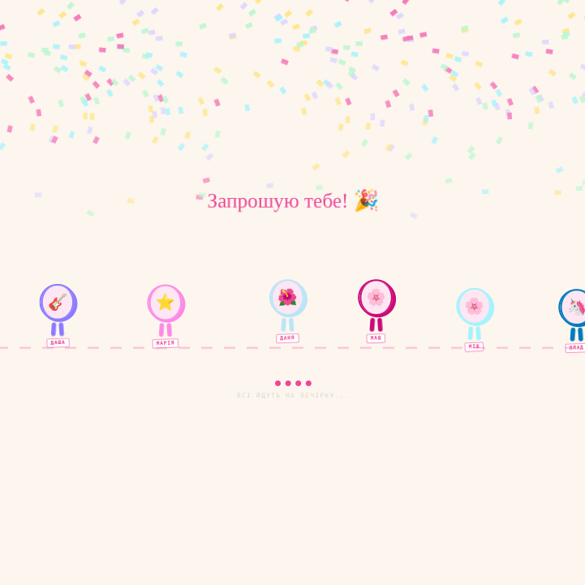
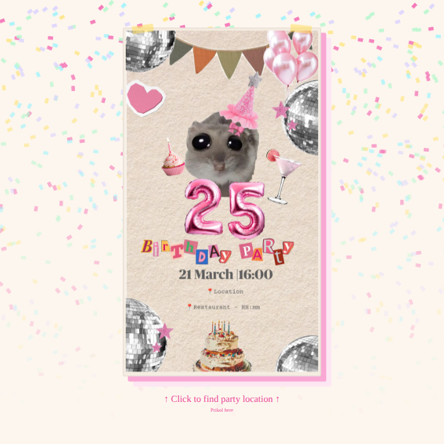

# 🎉 Birthday Invite — Interactive Party Invitation

A web-based birthday invitation with a secret entrance code, animated guest walkers, and a party card. Built as a reusable template for personal celebrations.
Active link: https://leomorgan113.github.io/birthday-invite/
---

## 📸 Preview

### 🔐 Entrance Code Page
Guests are prompted to enter a secret code before seeing the invitation.


> **Entrance code: `MASH25`**

> Add a birthday wishlist link for your friends.

---

### 🚶 Guest Walkers
An animated screen shows all invited guests walking to the party.



> 💡 For the walkers use your friends name and photos. It'll be fun!

---

### 🪩 Invitation Card
After entering the correct code, guests see the full party details.



> 🎨 An invitation card can be created in Pinterest using "Collage" tool. [My collage example.](https://www.pinterest.com/pin/846113848787006592/)

---

## ⚙️ How It Works

1. The guest opens the page and is shown a secret code input form.
2. They enter the code **`MASH25`** to unlock the invitation.
3. An animated scene shows all invited guests heading to the celebration.
4. The invitation card reveals party details (date, time, location).

---

## 🛠️ Project Setup

```sh
npm install
```

### Compile and Hot-Reload for Development

```sh
npm run dev
```

### Type-Check, Compile and Minify for Production

```sh
npm run build
```
